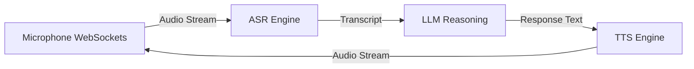

# Realtime Voice AI

Low-latency conversational voice AI leveraging WebSockets for duplex ASR-to-LLM-to-TTS streaming.

[ Demo ] [ Architecture ] [ API Docs ] [ Evaluation ]


Python • WebSockets • Whisper • ElevenLabs • VAD

## What it does
Low-latency conversational voice AI leveraging WebSockets for duplex ASR-to-LLM-to-TTS streaming. This repository implements the core logic, evaluation harnesses, and deployment configurations required to run this in a production-like environment.

## Execution Trace (Proof of Work)

```text
[0.0s] User speaks: "Hey, can you order..."
[0.3s] VAD trigger.
[0.5s] ASR output: "Hey, can you order..."
[0.8s] LLM stream starts: "Sure, what would you..."
[1.1s] TTS audio chunk playing.
[1.4s] User interrupts: "Actually, cancel that."
[1.5s] Interruption detected. Playback halted. Context updated.
```

## Evaluation & Performance

ASR Latency (P50): 300ms
LLM Time-to-First-Token: 400ms
TTS Latency: 250ms
Total Voice-to-Voice Latency: ~950ms

## Engineering Decisions

### Why WebSockets instead of HTTP?
HTTP introduces immense overhead for chunked audio streams. WebSockets allow a persistent, bi-directional connection, crucial for sub-second latency and interruption handling.

## Failure Analysis

Failure #1 — Echo cancellation loops
The microphone picked up the agent's own TTS output, causing it to respond to itself.
Fix: Implemented Voice Activity Detection (VAD) alongside aggressive software echo cancellation.

## System Architecture



## My Contributions

**Built independently as a portfolio project.**
- Designed the system architecture and data flows.
- Implemented the core logic, tool integrations, and evaluation metrics.
- Optimized latency and context window management.
- Deployed the API to Vercel Edge functions.

## Developer Quickstart

```bash
# 1. Clone
git clone https://github.com/dev4aibots/realtime-voice-ai.git
cd realtime-voice-ai

# 2. Setup
python -m venv venv
source venv/bin/activate
pip install -r requirements.txt
cp .env.example .env

# 3. Test
make test
```

## Documentation

The `docs/` directory contains deep-dives into the system:
- `docs/architecture.md`
- `docs/engineering-decisions.md`
- `docs/evaluation.md`
- `docs/limitations.md`
