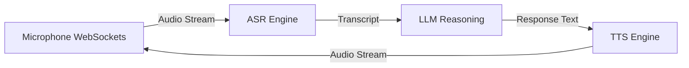

# Real-Time Voice AI


A low-latency, conversational voice AI system.

## Tech Stack
- **Python**
- **Real-time Systems** (WebSockets)
- **LLM APIs** (Streaming reasoning)
- **Backend Integration** (ASR -> LLM -> TTS pipeline)


## Architecture



## Live Endpoint (Interactive Demo)
This project is deployed as a serverless backend on Vercel. You can test the API instantly via your terminal.

```bash
# Example Request


curl -X GET https://realtime-voice-2b7vo4vtx-dev4aibots.vercel.app/api/health
```

## Demo
To generate a terminal GIF demonstration using `vhs`, run:
```bash
vhs demo.tape
```
